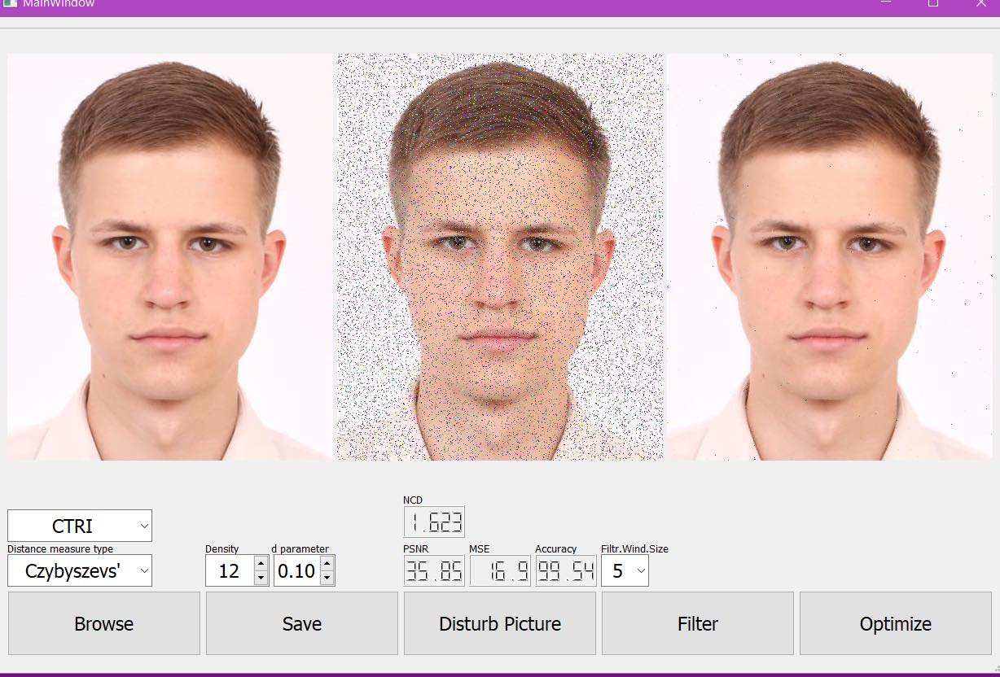

# FAPGF

Purpose of this project is exploring a possibility to accelerate [fast averaging peer group filter](https://www.researchgate.net/publication/282641853_Fast_averaging_peer_group_filter_for_the_impulsive_noise_removal_in_color_images) algorithm.

Explored libraries:

- [OpenMP](https://www.openmp.org/)
- [CUDA](https://developer.nvidia.com/cuda-zone)

## Setup

Project is in rebuild stage, due to lost uncommited changes. Please do not waste time on the setup part.

## GUI

GUI has been written using [Qt Framework](https://www.qt.io/product/framework).



## GPU

See `src/fapgf.cu` content. Algorithm was parallelized using rolling window approach. It has been tested on _GeForce GTX 1050Ti Mobile_ with _nvidia_driver_440_ on following configuration:

```sh
mqqlecule@mqqlecule:~/Documents/FAPGF(master)$ nvcc --version
nvcc: NVIDIA (R) Cuda compiler driver
Copyright (c) 2005-2017 NVIDIA Corporation
Built on Fri_Nov__3_21:07:56_CDT_2017
Cuda compilation tools, release 9.1, V9.1.85

mqqlecule@mqqlecule:~/Documents/FAPGF(master)$ uname -r
5.4.0-54-generic
```

## FAPGF

Implemented distance metrics:

- Euclidean distance
- Chebyshev distance

Noise types:

- Gussian noise
- CTRI noise
